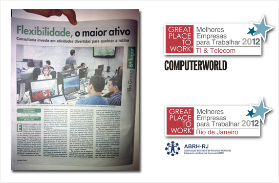

  

## Trabalhando na Innvent

A Innvent é um lugar onde pessoas incríveis combinam suas competências para
fazer inovação. Contando com grande experiência em gestão e tecnologia, além de
uma equipe altamente qualificada, a Innvent possui uma atuação *hands-on*
desenvolvendo, acelerando e alavancando negócios e startups. Ao todo, somos 15
empresas, 200 pessoas e estamos presentes em 4 cidades.

A ELO Group, principal empresa do grupo, foi eleita a [6ª melhor empresa para se
trabalhar no Rio de Janeiro](http://www.greatplacetowork.com.br/melhores-empresas/gptw-
rio-de-janeiro/698-2012) e [11ª melhor empresa do Brasil para se trabalhar com
TI](http://www.greatplacetowork.com.br/melhores-empresas/gptw-ti-a-telecom)
(GPTW 2012).

Nosso ambiente de trabalho é 100% descontraído com muito incentivo ao
crescimento profissional.

  

## Vagas e Contato

Explore o repositório para descobrir nossas vagas em aberto!

Caso deseje se canditar para uma vaga nos envie um *pull request* nesse
repositório. Referencie outros *pull requests* ou projetos que você tenha
orgulho. Mas acima de tudo, **nos surpreenda**!

Se preferir um contato mais privado, envie um email para os endereços
específicos de cada vaga.
